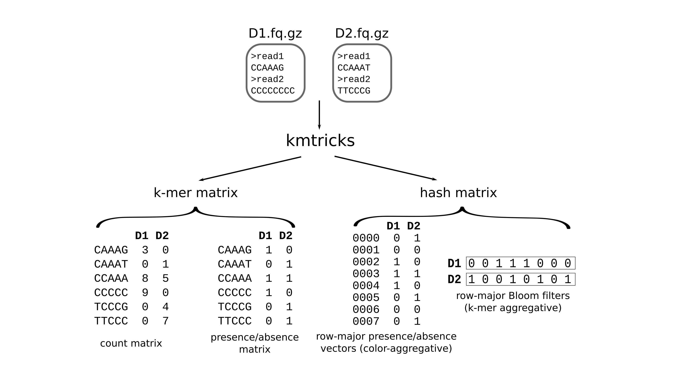
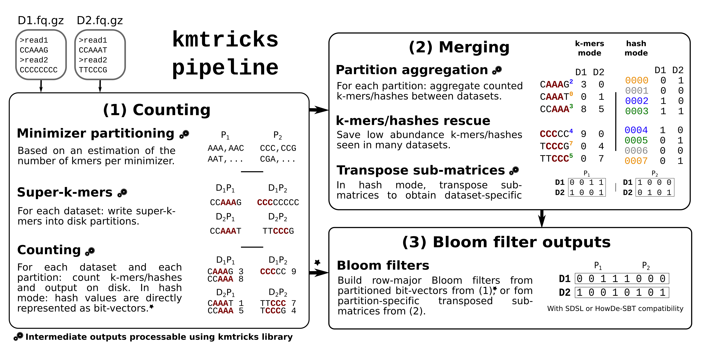

# kmtricks

[](http://www.gnu.org/licenses/agpl-3.0.en.html)


kmtricks is a modular tool suite for counting kmers, and constructing Bloom filters or kmer matrices, for large collections of sequencing data. 

## Rationale

kmtricks is optimized for the analysis of **multiple FASTA/FASTQ** files (gzipped or not). It features:
 * Fast **k-mer matrix** construction
 * Fast **Bloom filters** construction
 * **Rescues low-abundance k-mers** when they are seen in multiple samples

Note: for counting single file, kmtricks works but is slightly slower than a traditional k-mer counter (e.g. KMC). It is really optimized for merging count information across multiple samples, which traditional k-mer counters cannot do.

## Overview

**Input**: a set of read sets in FASTA or FASTQ format, gzipped or not.

**Final output** is either:

* a matrix of kmer abundances. M<sub>i,j</sub> is the abundance of kmer i in the read set j
* a matrix of kmer membership. M<sub>i,j</sub> is the presence (1) or absence (0) of kmer i in the read set j
* a vector of Bloom filters. M<sub>i,j</sub> is the presence (1) or absence (0) of the hash_value i (line numbers are hash values) in the read set j.
  * In this case, this matrix is provided vertically (one column is a bloom filter corresponding to one dataset).
  * After transposition, this matrix may also be provided horizontally (one line is a Bloom filter corresponding to one dataset). This enables to provide efficiently an independent Bloom filter per input read file.  


## Installation

<details><summary><strong>From conda</strong></summary>

```bash
conda install -c tlemane kmtricks
```

</details>

<details><summary><strong>From source</strong></summary>

Maximal size of k-mers and maximal stored counts must be set at compile time for some kmtricks binaries. 

**Available values:**
* KMER_NB_BIT=8;16;32;64;128 -> respectively for k less or equal to : 4, 8, 16, 32, 64
* COUNT_NB_BIT=8;16;32 -> respectively for max counts: 255, 65535, 4294967295.


```bash
git clone --recursive https://github.com/tlemane/kmtricks
cd kmtricks
mkdir build ; cd build

# Several example, use only one
cmake .. # Default, here KMER_NB_BIT="32;64" and COUNT_NB_BIT="8;16;32"
cmake .. -DKMER_NB_BIT="64;128" -DCOUNT_NB_BIT="32" # Select values
cmake .. -DKMER_NB_BIT=ALL -DCOUNT_NB_BIT=ALL # All available values

make -j8
```

`kmtricks.py` pipeline automatically selects the binaries to be used according to parameters or provides compilation instructions if the required binaries are missing.

A fork of HowDeSBT compatible with kmtricks bf is available. To compile it use: `-DHOWDE=1`. The index construction (i.e `km_howdesbt cluster` and `km_howdesbt build`) is equivalent to [classical HowDeSBT construction](https://github.com/medvedevgroup/HowDeSBT/tree/master/tutorial#3-create-a-tree-topology). However, query is different, use `km_howdesbt queryKm` instead of `howdesbt query`.


## Test

```bash
cd build
cmake .. -DTEST=1
ctest CTestTestfile.cmake
```
</details>
<br>

## kmtricks usage

kmtricks can be used in two different ways: by using each [**module**](modules.md) or by using the **pipeline** (highly recommended).


#### Input format

<u>File of file format:</u>
One sample per line, with an ID, a list of files and an optional solid threshold.
* \<Dataset ID> : \<1.fastq.gz> ; \<N.fastq.gz> ! \<Abundance min threshold>

<u>Fof example:</u>
```
A1 : /path/to/fastq_A1_1 ! 4
B1 : /path/to/fastq_B1_1 ; /with/mutiple/fasta_B1_2 ! 2
```
If the min abundance threshold is not specified, `--count-abundance-min` is used.

#### k-mer rescue procedure
In kmtricks, k-mer filtering is achieved by leverage k-mer abundances across samples. The following parameters can modulate this procedure.

* `--count-abundance-min INT`: An hard threshold, all k-mers with an abundance less than this parameter are discarded.
* `--merge-abundance-min INT/STR`: A soft threshold, all k-mers with an abundance between `count-abundance-min` and `merge-abundance-min` are considering rescue-able. If a sample-specific thresholds are required. You can provide the path of a file containing one threshold per line, with the same order as in the input fof.
* `--save-if INT`: If a k-mer is rescue-able, it is keep if it is solid (with an abundance greater than `merge-abundance-min`) in `save-if` other samples.
* `--recurrence-min INT`: All k-mers that do not occur in at least `recurrence-min` samples are discarded.

#### Outputs

```
my_run_directory/  
├── config.log # log about general parameter, git sha1, ect...
├── logs #enable all log with --debug or --log-files [repart,superk,count,merge,split]
│   ├── cmds.log # summary of module calls
│   ├── counter
│   ├── merger
│   ├── split
│   └── superk
└── storage
    ├── config_storage_gatb         # (0) GATB configuration files
    ├── partition_storage_gatb      # (1) --until repart
    │   └── minimRepart.minimRepart # minimizers repartition (required for queries)
    ├── superk_partitions           # (2) --until superk (partitioned super-k-mers)
    ├── kmers_partitions            # (3) --until count (partitioned k-mers)
    ├── matrix                      # (4) --until merge (partitioned matrices)
    ├── vectors                     # (5) full pipeline, bf output mode (--mode bf_trp)
    │   ├── howde                   # HowDeSBT files (--split howde)
    │   └── sdsl                    # SDSL files (--split sdsl)
    ├── fof.txt                     # copy of input fof (--file)
    └── hash_window.vec             # info about partitioned bf (required for queries)
```
### Examples

The following examples can be executed using example scripts at `./tests/kmtricks`. This requires that kmtricks is [installed with conda](#install).
#### 1. Build a k-mer count matrix

This example can be executed by running [example1.sh](tests/kmtricks/example1.sh) at `./tests/kmtricks`.

```bash
kmtricks.py run --file ./data/fof.txt \
                --run-dir ./count_matrix_run \
                --kmer-size 20 \
                --nb-cores 8 \
                --nb-partitions 4 \
                --count-abundance-min 1 \ # discard k-mers with an abundance less than 2
                --recurrence-min 1 \      # discard rows with k-mer that occurs in less than 1 sample
                --mode ascii \
                --lz4
```
kmtricks outputs one matrix per partition at `${run_dir}/storage/matrix/partition_${P}/ascii_matrix${P}.mat`. In each partition, k-mers are sorted using the following order : `A < C < T < G`.
* `--mode ascii`: Each file starts with a 8-rows header. Then each row corresponds to one k-mer and its count vector, space-separated. Order is the same as in the fof.

#### 2. Build and query an HowDe-SBT index using kmtricks partitioned Bloom filters

This example can be executed by running [example2.sh](tests/kmtricks/example2.sh) at `./tests/kmtricks`.

**Bloom filters construction with kmtricks**

```bash
kmtricks.py run --file ./data/fof.txt \
                --run-dir ./km_index \
                --kmer-size 20 \
                --nb-cores 8 \
                --nb-partitions 4 \
                --count-abundance-min 1 \ # discard k-mers with an abundance less than 2
                --recurrence-min 1 \      # discard rows with k-mer that occurs in less than 1 sample
                --mode bf_trp \           # enables Bloom filter construction
                --hasher sabuhash \       # HowDe-SBT hasher
                --max-hash 100000 \       # Bloom filter size
                --split howde \           # output Bloom filter with HowDe-SBT compatibility
                --lz4
```

If rescue is not required, the merging step can be skipped in Bloom filters mode by adding `--skip-merge`.

**Index construction with HowDe-SBT**  

```bash
cd ./km_index/storage/vectors/howde
ls *.bf > bf_list
km_howdesbt cluster bf_list
km_howdesbt build --howde bf_list
```

kmtricks produces HowDe-SBT compatible files. The index construction procedure remains the same as in classical HowDe-SBT. In other word, all `cluster` and `build` options are supported and have the same behavior as in HowDe-SBT.

**Queries**  
Query procedure differs from classical HowDe-SBT.
Two kmtricks files are required:
* `${run_dir}/storage/hash_window.vec`: contains informations about Bloom filter partitioning
* `${run_dir}/storage/partitions_storage_gatb/minimRepart.minimRepart`: contains the minimizers repartition

```bash
km_howdesbt queryKm \ # kmtricks-specific subcommand
            --tree=bf_list.detbrief.sbt \
            --repart=../../partition_storage_gatb/minimRepart.minimRepart \
            --win=../../hash_window.vec \
            queries.fa \ # fastx file that contains queries
            > results.txt
```

### kmtricks pipeline



`kmtricks.py` is a pipeline of [kmtricks modules](modules.md).

Note that this script also enables to run independently any module (option `--only`, this requires that previous was correctly executed) or enables to run modules until a step (option `--until`).

**Usage:**

```
usage: kmtricks.py run --file FILE --run-dir DIR [--kmer-size INT] [--count-abundance-min INT]
                       [--abundance-max INT] [--max-count INT] [--max-memory INT] [--mode STR]
                       [--nb-cores INT] [--merge-abundance-min INT/STR] [--recurrence-min INT]
                       [--save-if INT] [--skip-merge] [--until STR] [--only STR]
                       [--minimizer-type INT] [--minimizer-size INT] [--repartition-type INT]
                       [--nb-partitions INT] [--hasher STR] [--max-hash INT] [--split STR]
                       [--keep-tmp] [--lz4] [-h]

kmtricks pipeline

global:
  --file FILE                    fof that contains path of read files, one per line [required]
  --run-dir DIR                  directory to write tmp and output files [required]
  --kmer-size INT                size of a kmer [default: 31]
  --count-abundance-min INT      min abundance threshold for solid kmers [default: 2]
  --abundance-max INT            max abundance threshold for solid kmers [default: 3000000000]
  --max-count INT                allows to deduce the integer size to store counts [default: 255]
  --max-memory INT               max memory in megabytes (per core) [default: 8000]
  --mode STR                     output matrix format: [bin|ascii|pa|bf|bf_trp] [default: bin]
  --log-files                    enables log files [repart|superk|count|merge|split] [default: ]
  --nb-cores INT                 number of cores [default: 8]
  --keep-tmp                     keep all tmp files [no arg]
  --lz4                          lz4 compression for tmp files [no arg]
  -h, --help                     Show this message and exit

merge options:
  --merge-abundance-min INT/STR  min abundance threshold for solid kmers [default: 1]
  --recurrence-min INT           min reccurence threshold for solid kmers [default: 1]
  --save-if INT                  keep a non-solid kmer if it's solid in X dataset [default: 0]
  --skip-merge                   skip merge step, only with --mode bf [no arg]

pipeline control:
  --until STR                    run until step: [repart|superk|count|merge|split] [default: all]
  --only STR                     run until step: [repart|superk|count|merge|split] [default: all]

advanced performance tweaks:
  --minimizer-type INT           minimizer type (0=lexi, 1=freq) [default: 0]
  --minimizer-size INT           size of minimizer [default: 10]
  --repartition-type INT         minimizer repartition (0=unordered, 1=ordered) [default: 0]
  --nb-partitions INT            number of partitions (0=auto) [default: 0]

hash mode configuration:
  --hasher STR                   hash function: sabuhash, xor [default: xor]
  --max-hash INT                 max hash value (uint64_t) [default: 1000000000]
  --split STR                    split matrix in indidual files: [sdsl|howde] (only with --mode bf_trp) [default: none]
```

## Limitations

kmtricks needs disk space to run. The disk usage is variable and depends on data, parameters and output format. Based on our observations, the required space is between 20% of the total input size (gzipped) and the total input size (including outputs).

## Benchmark

Compared to a usual pipeline as the one used by `HowDe-SBT` using `Jellyfish` and `KMC` for generating a Bloom filter per input read set.

|      Method                 | Indexation time | Max memory | Disk usage |
|:---------------------------:|:---------------:|:----------:|:----------:|
| HowDeSBT makebf (Jellyfish) |      59h03      |   13.2 GB  |   206 GB   |
| HowDeSBT makebf (KMC)       |      32h38      |   18.7 GB  |   165 GB   |
| kmtricks                    |      20h06      |   21.6 GB  |   233 GB   |
| kmtricks - [rescue mode](#k-mer-rescue-procedure)  |      20h46      |   17.4 GB  |   327 GB   |

Test realised with 674 RNA-seq experiments (961 GB gzipped) with 20 cores (Intel(R) Xeon(R) 2.60GHz) and 100 GB RAM.
List of IDs available [here](./tests/kmtricks/experiment_list_674.txt).

Other benchmarks and results can be found [here](https://github.com/pierrepeterlongo/kmtricks_benchmarks).

### Advanced usage

Some kmtricks features (e.g. matrix streaming) are provided by using kmtricks pipeline combined with the [kmtricks library](./libs/kmtricks). Examples available [here](./developers.md).

## Contacts

Téo Lemane: teo.lemane@inria.fr

Rayan Chikhi: rayan.chikhi@pasteur.fr

Pierre Peterlongo: pierre.peterlongo@inria.fr

