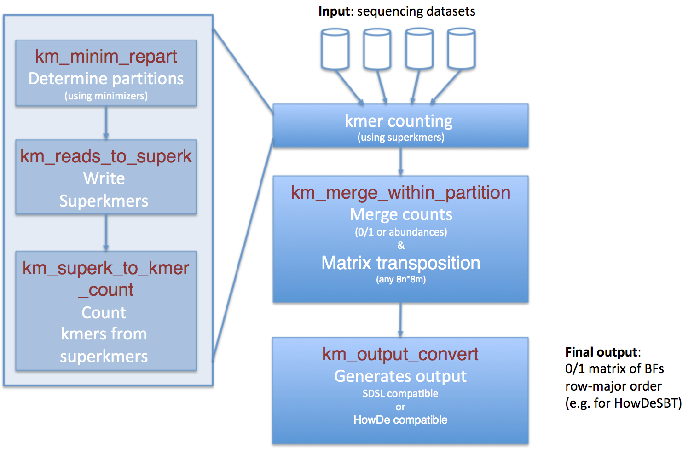

### kmtricks modules

kmtricks is composed of 5 modules.



**Note1:** Using any of those modules requires the existence of the `run-dir` directory and its whole internal structure. The creation of the directory and its structure can be done thanks to the following command: 

`python3 kmtricks.py env`

```
my_run_directory/  
├── config.log # log about general parameter, git sha1, ect...
├── logs #enable all log with --debug or --log-files [repart,superk,count,merge,split]
│   ├── cmds.log # summary of module calls
│   ├── counter
│   ├── merger
│   ├── split
│   └── superk
└── storage
    ├── config_storage_gatb         # (0) GATB configuration files (kmtricks.py env)
    ├── partition_storage_gatb      # (1) --until repart (queryable using repartition.hpp)
    │   └── minimRepart.minimRepart # minimizers repartition (required for queries)
    ├── superk_partitions           # (2) --until superk (readable using skreader.hpp)
    ├── kmers_partitions            # (3) --until count  (stream matrix from here using merger.hpp)
    ├── matrix                      # (4) --until merge --mode [ascii|bin|bf|bf_trp]
    ├── vectors                     # (5) full pipeline in bf output mode (--mode bf_trp)
    │   ├── howde                   # with --mode bf_trp --split howde (input BFs for HowDeSBT cluster/build)
    │   └── sdsl                    # with --mode bf_trp --split sdsl
    ├── fof.txt                     # copy of input fof (--file)
    └── hash_window.vec             # info about partitioned bf (required for queries)
```

**Note2:** Run any of the binary with no argument provides a detailed list of options and mandatory arguments.

Each module is presented below. However, the `kmtricks.py` script enables to execute automatically all modules (with additional checks). See the [kmtricks pipeline](./README.md#kmtricks-pipeline) section.

#### Module `km_minim_repart`: determine partitions

From reads, determine minimizers and assign each minimizer to a partition.

Example: `./bin/km_minim_repart -file file_of_files.txt -kmer-size 31 -run-dir my_directory_output_name`

#### Module `km_reads_to_superk`: from reads to partitioned super kmers

For each read file,  using the previously determined partitions from minimizers, write superkmers into corresponding partitions

Example: `./bin/km_reads_to_superk -id S1 -file read_file.fasta -run-dir my_directory_output_name -nb-cores 8 -kmer-size 31`

#### Module `km_superk_to_kmer_counts`: from super kmers to counted elements 

For one superkmer partition, determine, sort and count elements that may be kmers or hash value.

Example: `./bin/km_reads_to_kmer_counts -file read_file.fasta -run-dir my_directory_output_name -kmer-size 31 -part-id N`

Option `-mode` enables to provide results either as kmers or hash values 

#### Module `km_merge_within_partition ` merges counted kmers and transpose matrix

For a given partition id, merges values for all input read files. 

Example: `./bin/km_merge_within_partition -run-dir my_directory_output_name -part-id 0 -abundance-min 2 -recurrence-min 2`

#### Module `km_output_convert`: generates output for downstream usages

Given the merged partitions, depending on the user choice, outputs a SDSL compatible or a HowDeSBT compatible set of files. 

Example: `./bin/km_output_convert from_merge -run-dir my_directory_output_name -nb-files nb_of_reads_files -split howde -kmer-size 31`